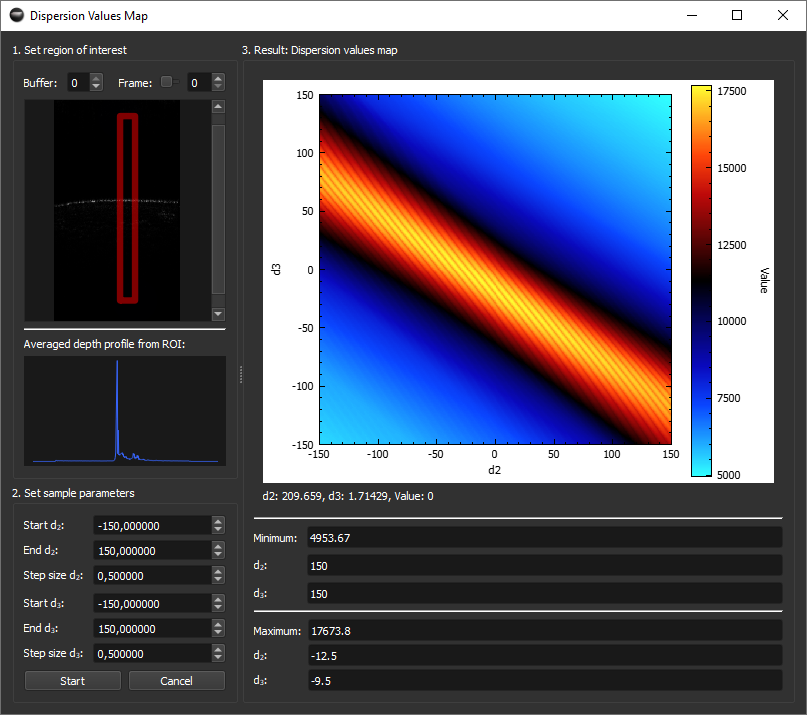

# Dispersion Values Map

Dispersion Values Map is a  plugin for [OCTproZ](https://github.com/spectralcode/OCTproZ).

  

## Overview

Dispersion Values Map is designed to evaluate all possible dispersion parameters within a specified range and step size. It plots the resulting peak height from a selected region of interest as a function of the dispersion parameters d2 and d3. The optimal values of d2 and d3 correspond to the maximum peak value.

In OCT systems, dispersion mismatch broadens the peaks in an A-scan. Numerical dispersion compensation improves axial resolution but conserves the overall energy. This means that the peak width is narrowed and the peak height is maximized.  

## License

This project is licensed under the GPLv3 License. For more details, see the [LICENSE](LICENSE) file.
